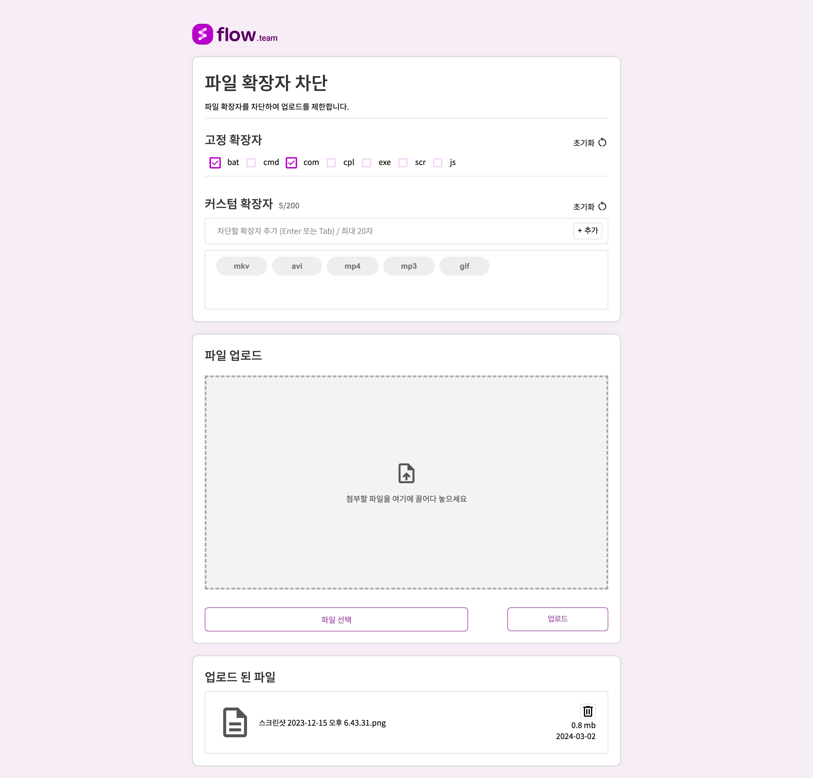

# 파일 확장자 차단 과제

## 개발환경

- HTML, CSS3, JavaScript (프론트엔드)
- JQuery (라이브러리)
- Java, Spring Boot (백엔드)
- PostgresSQL

## 과제 설명

어떤 파일들은 첨부시 보안에 문제가 될 수 있습니다. 특히 exe, sh 등의 실행파일이 존재할 경우 서버에 올려서 실행이 될 수 있는 위험이 있어 파일 확장자 차단을 하게 되었습니다.

## 과제 공지

1. “파일 확장자 차단” 과제를 제출해주시기 바랍니다.
2. 파일 확장자 차단 : 화면 호출까지 되면 좋을 것 같습니다.

   (정확하지 않다고 생각되는 부분은 자신의 생각을 고려해서 진행하시기 바랍니다.)

3. 하실 수 있는 부분까지 제출하시면 됩니다. 정답은 없으며, 어떤 생각을 하셨는지가 중요합니다.

## 제출 파일

1. 면접 당일까지 유지되는 사이트를 제출하시기 바랍니다.
2. 과제를 수행한 git 주소 제출

## 기본 기능

> ### 고정 확장자
  - [x] checkBox를 이용하여 고정 확장자를 선택할 수 있어야 한다.
    - [x] bat, cmd, com, cpl, exe, scr, js
    - [x] default: unCheck

  - [x] 사용자가 체크를 하면 checked에 따라 db에 기록될 수 있어야 한다.

  - [x] 고정 확장자는 커스텀 확장자에 추가할 수 없어야 한다.
> ### 커스텀 확장자
  - [x] 사용자는 추가할 커스텀 확장자를 입력할 수 있어야 한다.
    - [x] 커스텀 확장자에는 고정 확장자를 추가할 수 없어야 한다.
    - [x] 최대 20자 이내로 입력할 수 있어야 한다.

  - [x] 사용자는 추가 버튼을 클릭하여 커스텀 확장자를 추가할 수 있어야 한다.
    - [x] 추가한 커스텀 확장자는 db에 기록될 수 있어야 한다.

  - [x] 커스텀 확장자는 최대 200개까지 추가할 수 있어야 한다.
  - [x] 아래쪽 영역의 확장자의 옆 X를 클릭시 해당 확장자를 삭제할 수 있어야 한다.

## 추가 기능

---

> ### 고정 확장자
  - [x] 초기화 버튼 클릭시 모든 확장자를 초기화 할 수 있어야 한다.
> ### 커스텀 확장자
  - [x] 초기화 버튼 클릭시 모든 확장자를 초기화 할 수 있어야 한다.

  - [x] 확장자를 추가 했을 때 중복 체크할 수 있어야 한다.
    - [x] 중복된 확장자가 있을 경우 alert으로 알림창을 띄워야 한다.
    - [x] 중복된 확장자가 있을 경우 추가되지 않아야 한다.

  - [x] 정규식을 사용하여 영어, 한글, 숫자의 조합으로만 입력할 수 있어야 한다.

  - [x] 커스텀 확장자에 스크롤이 생기면 스크롤이 생겼을 때 확장자가 보이도록 해야 한다.

  - [x] 확장자를 추가할 때 엔터, 탭키를 누르면 추가할 수 있어야 한다.

  - [x] 확장자가 추가되면 input에 입력된 값이 초기화 되어야 한다.
> ### 파일 업로드
  - [x] 파일을 실제로 업로드 할 수 있어야 한다.
    - [x] 파일이 없을 경우 무시되어야 한다.
    - [x] 화면에 업로드한 파일이 보여야 한다.
    - 파일을 업로드 할 때 확장자가 차단된 확장자가 아닐 경우
      - [x] 업로드 되어야 한다.
      - [x] db에 기록되어야 한다.
    - 파일을 업로드 할 때 확장자가 차단된 확장자일 경우
      - [x] 업로드 되지 않아야 한다.
      - [x] db에 기록되지 않아야 한다.
      - [x] alert으로 알림창을 띄워야 한다.

  - [x] 업로드할 파일을 제거할 수 있어야 한다.
    - [x] 화면에 업로드한 파일이 보여야 한다.
    - [x] 업로드한 파일을 제거할 수 있어야 한다.
    - [x] 업로드한 파일을 제거할 때 alert으로 알림창을 띄워야 한다.

  - [x] 업로드한 파일을 제거할 수 있어야 한다.
    - [x] 화면에서도 제거되어야 한다.
    - 파일을 제거할 때
      - [x] db에 기록된 파일도 제거되어야 한다.
      - [x] alert으로 알림창을 띄워야 한다.
      - [x] 파일이 없으면 alert으로 알림창을 띄워야 한다.

  - [x] 업로드한 파일을 다운로드 할 수 있어야 한다.
    - [x] 화면에 업로드한 파일이 보여야 한다.
    - [x] 업로드한 파일을 다운로드 할 수 있어야 한다.

  - [x] 업로드 파일의 용량을 제한할 수 있어야 한다.
    - [x] 128MB 이하의 파일만 업로드 할 수 있어야 한다.

  - [x] 확장자 금지 했을 때 해당 확장자의 파일이 있을 경우 삭제할 수 있어야 한다.
    - [x] db에 기록된 파일도 제거되어야 한다.
    - [x] alert으로 알림창을 띄워야 한다.
